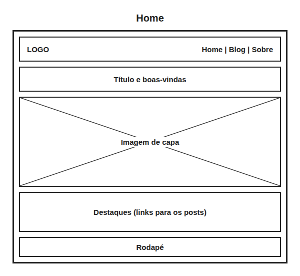
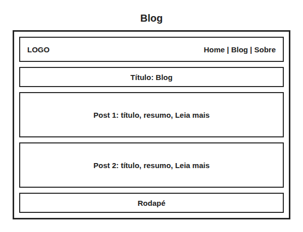
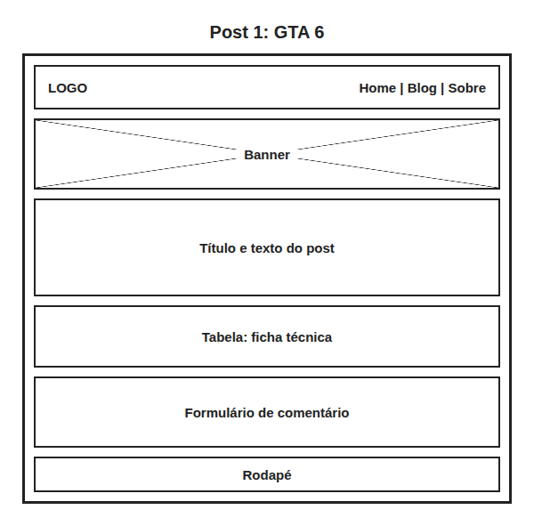
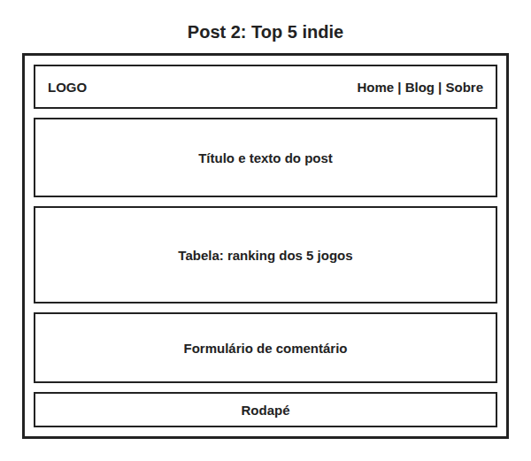
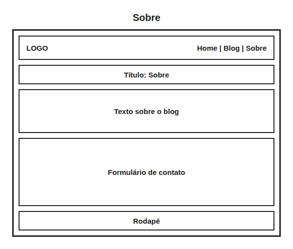

# Game Over Blog

Blog sobre videogames feito com HTML e CSS.

**Aluno:** Nicolas Safra Gazige · **Turma:** WEBI-ISW028-A
**Site:** https://n-safra.github.io/game-over-blog/

## Linguagens de marcação

| Linguagem | Para que serve | Exemplo |
|---|---|---|
| **HTML** | Criar páginas de sites | `<h1>Título</h1>` |
| **XML** | Guardar e trocar dados | `<jogo>Hades II</jogo>` |
| **Markdown** | Escrever textos simples, como este README | `# Título` |

Usei **HTML** no site porque é a linguagem que o navegador mostra como página.

## Páginas

- `index.html`: página inicial
- `blog.html`: lista de posts
- `post1.html`: prévia do GTA 6
- `post2.html`: Top 5 jogos indie
- `sobre.html`: sobre o blog e contato

## Wireframes

| Home | Blog | Post 1 | Post 2 | Sobre |
|---|---|---|---|---|
|  |  |  |  |  |

## Escolhas

- **Tags semânticas** (`header`, `main`, `article`, `footer`) para organizar a página.
- **Um só arquivo CSS** para todas as páginas, assim fica mais fácil mudar o visual.
- **Pastas separadas** para CSS e imagens.

## Problemas e soluções

- **O site ficava sem cor em outro PC:** faltava a pasta `static`. Solução: enviar a pasta inteira.
- **Os dois posts abriam a mesma página:** criei o `post2.html` e corrigi os links.
